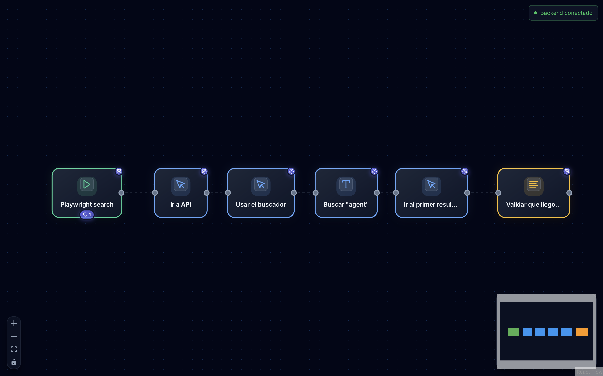

<div align="center">
  
  <h1>QA Flow</h1>
  <p><strong>Editor visual de pruebas automatizadas con Playwright</strong></p>
  <p>Diseña, ejecuta y gestiona tus tests de forma intuitiva mediante un canvas de nodos arrastrables. Sin escribir código.</p>

  <br />

  [](https://www.npmjs.com/package/@davidg97/qa-flow)
  [](https://hub.docker.com/r/davidg1997/qa-flow)
  [](LICENSE)
  
  <br />
  
  <a href="#quick-start">Quick Start</a> •
  <a href="#-características">Características</a> •
  <a href="#-guía-de-uso">Guía</a> •
  <a href="#-docker">Docker</a> •
  <a href="https://davidg97.github.io/qa-flow">Website</a>
</div>

<br />

<div align="center">
  
</div>

<br />

## Quick Start

Prueba QA Flow al instante con [npx](https://docs.npmjs.com/cli/v7/commands/npx) (requiere [Node.js](https://nodejs.org/) y [Docker](https://docs.docker.com/get-docker/)):

```bash
npx @davidg97/qa-flow
```

O ejecuta directamente con Docker:

```bash
docker run -it --rm -p 3001:3001 -v qa-flow-data:/app/data davidg1997/qa-flow
```

Abre **http://localhost:3001** → Login: `admin@qaflow.com` / `admin123`

---

## ✨ Características

| Categoría | Funcionalidades |
|-----------|----------------|
| **Editor** | Canvas interactivo, nodos arrastrables, conexiones visuales |
| **Ejecución** | Tiempo real vía WebSocket, paralela con workers, reintentos |
| **Navegadores** | Chromium, Firefox, WebKit + emulación de dispositivos |
| **Reportes** | HTML estilo Playwright, screenshots, historial |
| **Código** | Genera Playwright ejecutable, graba interacciones |
| **Gestión** | Page Objects, locators reutilizables, import/export JSON |
| **Seguridad** | Autenticación JWT, roles (Admin/Usuario) |

---

## 📖 Guía de Uso

### 1. Crear Proyecto

1. Inicia sesión con `admin@qaflow.com` / `admin123`
2. Click en "Nuevo Proyecto"
3. Nombra tu proyecto

### 2. Diseñar Test

1. **Arrastra el nodo "Inicio"** → configura URL y navegador
2. **Agrega acciones**: Navegar, Click, Escribir, Verificar
3. **Conecta los nodos** arrastrando entre puntos

### 3. Configurar Selectores

- **Picker Visual** 🎯: Selecciona elementos directamente en el navegador
- **Manual**: Escribe selector CSS/XPath

### 4. Ejecutar

1. Click en **▶️ Ejecutar**
2. Observa progreso: 🟢 éxito, 🔴 fallo, 🟡 en curso
3. Revisa el **reporte HTML** generado

### Ejemplo: Test de Login

```
[Inicio] → [Navegar: /login] → [Escribir: email] → [Escribir: password] → [Click: Enviar] → [Verificar: Dashboard]
```

<details>
<summary>Ver configuración</summary>

| Nodo | Configuración |
|------|---------------|
| Inicio | URL: `https://miapp.com`, Navegador: Chromium |
| Navegar | Path: `/login` |
| Escribir | Selector: `#email`, Texto: `usuario@test.com` |
| Escribir | Selector: `#password`, Texto: `mipassword` |
| Click | Selector: `button[type="submit"]` |
| Verificar | Selector: `.dashboard`, Tipo: `visible` |

</details>

---

## 🎯 Tipos de Nodos

| Tipo | Nodos |
|------|-------|
| **Trigger** | Inicio (URL, navegador, viewport) |
| **Hooks** | beforeAll, beforeEach, afterEach, afterAll |
| **Acciones** | Navegar, Click, Escribir, Esperar, Screenshot, Scroll, Hover, Tecla |
| **Aserciones** | Verificar texto, visible, URL, atributo |

### Emulación de Dispositivos

El nodo Inicio permite emular:
- **Dispositivos**: iPhone, Pixel, iPad, Galaxy
- **Viewport**: Ancho, alto, escala
- **Localización**: Idioma, zona horaria, geolocalización
- **Apariencia**: Tema claro/oscuro
- **Red**: Modo offline, User Agent

---

## 🐳 Docker

### Docker Compose (recomendado)

```bash
echo "JWT_SECRET=$(openssl rand -base64 32)" > .env
docker compose up -d
```

### Con PostgreSQL (producción)

```bash
cat > .env << EOF
JWT_SECRET=$(openssl rand -base64 32)
POSTGRES_PASSWORD=$(openssl rand -base64 16)
EOF

docker compose -f docker-compose.yml -f docker-compose.prod.yml up -d
```

### Imágenes

```bash
docker pull davidg1997/qa-flow:latest  # Estable
docker pull davidg1997/qa-flow:beta    # Últimas features
```

### Variables de Entorno

| Variable | Descripción | Default |
|----------|-------------|---------|
| `PORT` | Puerto del servidor | `3001` |
| `JWT_SECRET` | Secret para tokens JWT | ⚠️ Requerido |
| `DATABASE_URL` | URL de conexión a BD | SQLite local |

---

## ⚙️ Configuración del Proyecto

En el modal de configuración:

| Opción | Descripción |
|--------|-------------|
| **Modo** | Serial o Paralelo |
| **Workers** | Instancias paralelas (1-10) |
| **Reintentos** | Veces a reintentar fallidos |
| **Timeout** | Tiempo máximo por acción |
| **Max Failures** | Detener después de N fallos |

---

## 🔐 Seguridad en Producción

⚠️ **Antes de desplegar**:

1. Configura `JWT_SECRET` (mínimo 32 caracteres)
2. Cambia credenciales del admin inicial
3. Usa HTTPS

---

## 🤝 Contribuir

¿Quieres contribuir? Ver [CONTRIBUTING.md](CONTRIBUTING.md) para:
- Setup de desarrollo local
- Estructura del proyecto
- Base de datos y API
- Guía de commits

---

## 📄 Licencia

[Apache License 2.0](LICENSE)

---

Desarrollado con ❤️ usando React, Playwright y Prisma
